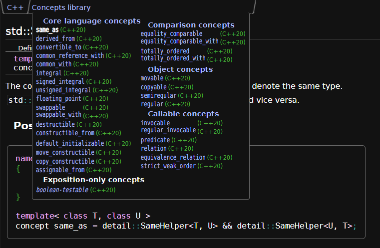

# Using C++20 Concepts to limit implicit conversions.

On top of the conditional explicit specifier, C++20 gave us another tool for better control over implicit conversions.

Concepts can prevent or limit the scope of implicit conversions on the accepting side.




```C++
#include <concepts>
#include <cstdint>

// Prevent implicit conversions for arguments:
void some_func1(int) {}
void some_func2(std::same_as<int> auto) {}

some_func1(2.4); // OK, double -> int implicit conversion
some_func2(2.4); // Will not compile
// auto deduces double, std::same_as<int,double> is not satisifed

// Works for deduced return types:
auto some_func3() -> int {
    return 2.4 + 2; // OK
}
auto some_func4() -> std::same_as<int> auto {
    return 2.4 + 2; // Will not compile, constraint not satisfied
}

// As well as variables:
uint8_t a = 1, b = 2;
uint8_t c = a + b;
std::same_as<uint8_t> auto d = a + b; // Will not compile
// Integral promotion from uint8_t to int, int + int -> int
```

[Open the example in Compiler Explorer.](https://compiler-explorer.com/z/jGhv7YdYh)
